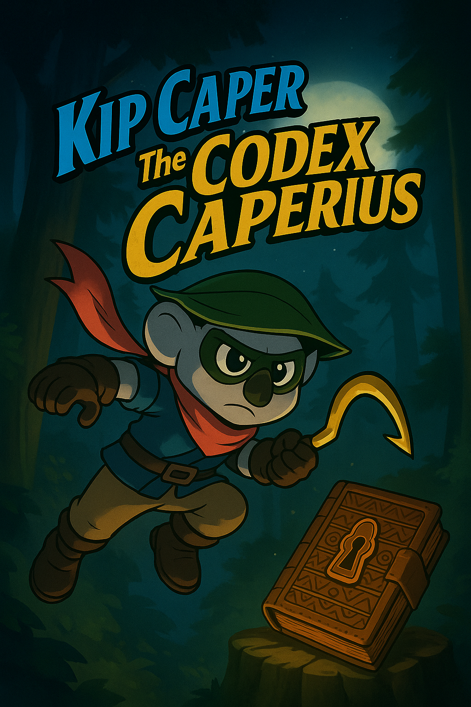

# 🎩 Kip Caper and the Codex Caperis 🐨🌿

A cel-shaded stealth action-adventure starring Kip the Koala — outsmart poachers, uncover ancient jungle relics, and restore your family's legacy one Codex fragment at a time.

## 🎮 Game Overview

Inspired by the *Sly Cooper* series, **Kip Caper and the Codex Caperis** is a third-person cel-shaded stealth-platformer built in Unreal Engine 5.6.0. You play as Kip, a clever and cheeky humanoid koala thief reclaiming stolen relics across jungle canopy outposts.

- 🔍 **Stealth, Climbing, Gliding, Koala tricks and abilities, and Gadgets**
- 📖 **Narrative storyline progression via Codex fragments and mission completion**
- 🏝️ **Evolving treetop hub village**
- 🧩 **Mystical relic puzzles and platforming zones**
- 👤 **Comic panel cutscenes with voiceover narration**

## 📦 Current Scope

**Playable Demo Includes:**
- 🎯 Main Menu UI
- 🌲 Chapter 1: Logging Camp Lockdown
- 🏡 Hub Area: Treetop Refuge (Totem Shrine + Skill Unlock)
- 🔓 Unlockable Codex Skill: *Caper Canopy Waltz (aka a dash across thin wire walk ways) *

> Kip’s journey begins by infiltrating a poacher-run sawmill to recover the first Codex fragment and escape before the whole platform collapses...

## 🗺️ Chapter Structure (6 Total)

1. **Logging Camp Lockdown** 🌲 – (Demo Level)
2. **The Howling Gorge** 🌬️ – wind tunnels & echo stealth
3. **Waterfall Monastery** ⛩️ – relic puzzles & wall-running
4. **Night Safari Outpost** 🌙 – thermal stealth & laser traps
5. **Sunken Totem Boneyard** 💀 – waterlogged ruins & wall cling
6. **The Hollowed Crown** 👑 – final heist & ancient fortress

Each chapter ends with a miniboss and a new **Codex Skill**.

---

## 🛠️ Development Stack

- 🎮 Unreal Engine 5.6.0
- 🧠 Blueprint-only (no C++)
- 🎨 Cel-shaded visual style (stylized post-process)
- 🎧 Dynamic jungle soundtrack (bongo & flute loops)
- 🗂️ GitHub project management (issues, milestones, builds)

---

## 🧵 Credits

- **Game Design & Dev:** PhoenixGold Game Studios (Solo Dev: Trevor H)
- **Inspiration:** Sly Cooper series, Koala lore
- **Engine Tools:** Unreal Engine 5.6, Mixamo, Blender. Adobe Creative Cloud
